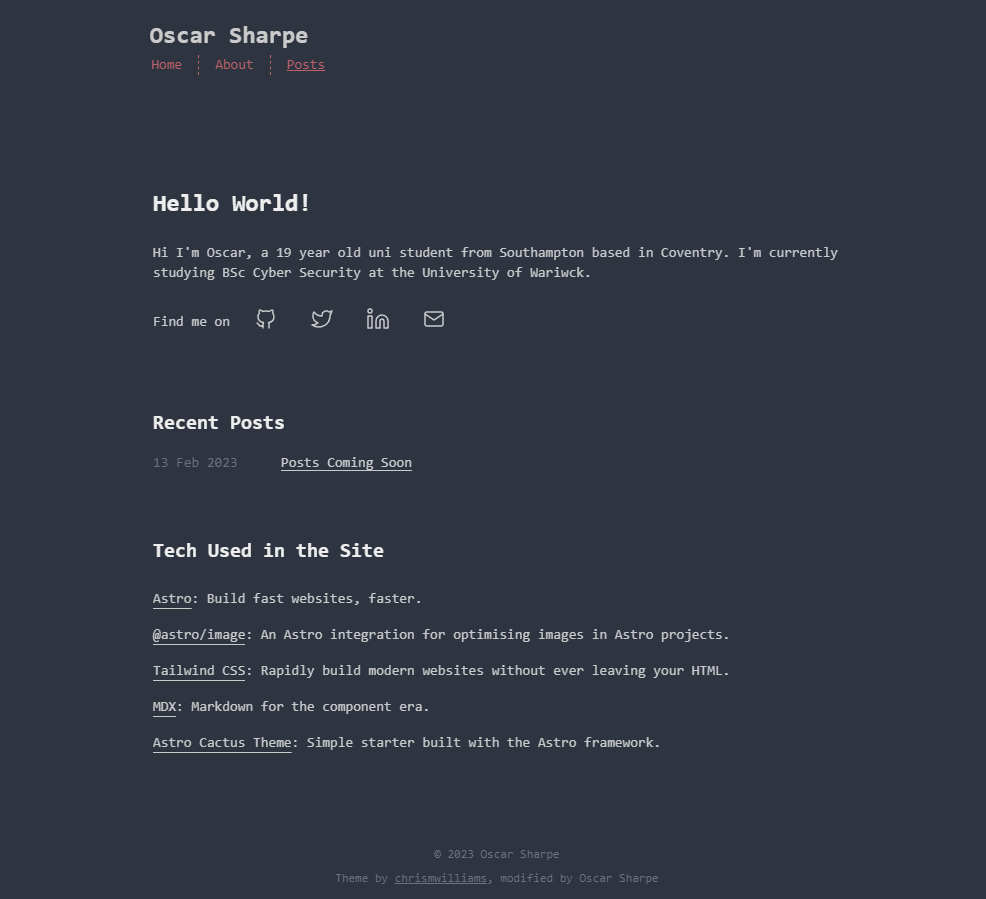

<h1 align="center">
   My Personal Site 
</h1>

My personal website built using the Astro framework and [Astro Cactus theme ](https://github.com/chrismwilliams/astro-theme-cactus)

## Key Features

- Astro Fast 🚀
- TailwindCSS Utility classes
- Accessible, semantic HTML markup
- Responsive & SEO-friendly
- Dark / Light mode, using Tailwind and CSS variables
- MD & [MDX](https://docs.astro.build/en/guides/markdown-content/#mdx-only-features) posts
- [Satori](https://github.com/vercel/satori) for creating open graph png images.
- Pagination
- Shiki code syntax styling
- Auto-generated [sitemap](https://docs.astro.build/en/guides/integrations-guide/sitemap/)

## Site Preview

  

